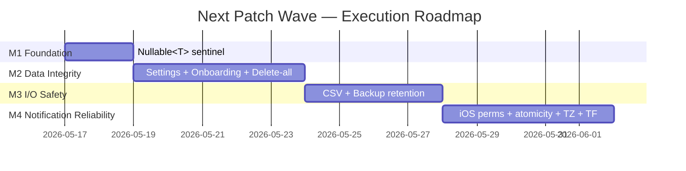

# [LP-PLAN] Next Patch Issues — Métra

```yaml
# metadata
project: metra
version: 1.0.0
supersedes: null
context-priority: high
```

**Date**: 2026-05-16
**Author**: lp-planner
**Status**: draft
**Spec ref**: `.claude/docs/specs/lp-20260516-next-patch-issues-spec.md`

---

## 1. Context

Pre-MVP patch wave closing 14 verified defects in the "Next Patch" column across Settings, CSV import/export, Backup/cloud sync, Onboarding, and Notifications. The wave eliminates two critical silent-data-loss paths (empty-backup overwrite #11; duplicate-anchor corruption #28), promotes one foundational tech-debt fix (`Nullable<T>` sentinel) that unblocks clean patches downstream, and lands before any new feature work consumes the contested files. See spec §1 for full behavioural breakdown.

---

## 2. Key Decisions

| Decision | Rationale | Implication |
|----------|-----------|-------------|
| **OQ-01 → Option A**: `TransactionRunner` abstract interface in `lib/domain/repositories/` + `DriftTransactionRunner` in `lib/data/repositories/` delegating to `AppDatabase.transaction`. Injected as 5th constructor arg into `CompleteOnboarding`. | Preserves the `domain → data` import boundary (NFR-07); makes onboarding atomic without leaking Drift types into the use case. | Steps 1–4 of `CompleteOnboarding.execute` run inside one transaction; double-execute regression test must observe `cycleRepo.entries.length == 1` (R-02). |
| **OQ-02 → Option A**: `SchedulePredictionNotification.execute` returns `Future<bool>` (true = scheduled, false = failed). Callers propagate; settings listener shows non-blocking SnackBar on false. `FakeNotificationService` updated to match. | Surfaces `PlatformException` as an observable signal without throwing (FR-12); aligns with `Result`-style error handling from spec §5.1. | Every caller of `SchedulePredictionNotification.execute` and the `FakeNotificationService` test double must be updated in the same Phase 4 commit; `app.dart` dead catches become substantive SnackBar feedback. |
| **Phase 1 ships before Phase 2 starts** | The clean fix for #13 (theme→System data loss) depends on the `Nullable<T>` sentinel from FR-01; the workaround alternative is explicitly rejected. | Phase 2 cannot start until Phase 1 closes — first sequential gate on the critical path. |
| **`use_case_providers.dart` lands in one Phase 2 commit** | Both `DeleteAllData` (#11) and `CompleteOnboarding` (#28) re-wire this provider file (R-19). | Phase 2 SP must bundle both wiring changes; Phase 4 picks up only after Phase 2 merges to avoid double-touch. |
| **TestFlight smoke on physical iOS device gates Phase 4 close** | iOS fixes #31 (permission state), #32 iOS surface, #35 iOS (`wallClockTime`) are not verifiable in any local environment (no iOS simulator on Fedora — NFR-06). | Phase 4 cannot be marked complete until the TestFlight smoke checklist is signed off; build a TestFlight gate item into the Phase 4 transition criteria. |

---

## 3. Constraints

| Constraint | Source | Value |
|------------|--------|-------|
| Stack | spec §5.1 | Flutter 3.x + Dart, Riverpod 2.x, Drift + SQLCipher, GPL-3.0 headers, `dart format` + `flutter analyze` clean per commit |
| Deadline | spec §1.3 (pre-MVP run-up) | Soft — wave must land before next feature work touches `settings_screen.dart` or `use_case_providers.dart` |
| Layering | spec §5.1 + NFR-07 | `domain/` imports nothing from `data/` or `features/`; new abstractions respect this boundary |
| Runtime dependencies | NFR-07 | Zero net additions to `pubspec.yaml` |
| iOS verification | NFR-06 + env (no Mac, no iOS simulator on Fedora) | Physical iOS device via TestFlight is the only verifiable path for #31, #32 iOS-surface, #35 iOS |
| Accessibility | NFR-01 | WCAG 2.2 AA SC 3.3.4 — destructive-action confirmation (#18) has non-destructive default focus, dismissible |
| Privacy / local-first | NFR-04 | No telemetry, no new third-party service contact; encrypted-blob upload to Dropbox only |
| Test coverage | NFR-08 + FR-15 | Each FR has at least one regression test that fails on pre-fix code and passes on post-fix code |

---

## 4. Criticalities & Dependencies

### Critical path

- **CP-01** — Milestone 1 (Foundation: `Nullable<T>` sentinel) — blocks the clean #13 fix in Milestone 2; any Phase 2 start without it forces the workaround alternative.
- **CP-02** — Milestone 2 (Data Integrity) — its provider-wiring commit (`use_case_providers.dart` with both `DeleteAllData` + `CompleteOnboarding` changes) must merge before Milestone 4 begins, to avoid wiring conflicts on the `SchedulePredictionNotification` injection.
- **CP-03** — Milestone 4 #32 fix (`PlatformException` surfacing as `Future<bool>`) must precede the #33 atomicity regression test, which depends on the new observable signal to assert "cancel + fail" behaviour.
- **CP-04** — TestFlight build + physical-device smoke gates the close of Milestone 4 — no local substitute exists.

### Shared-file contention (carry from spec §7 R-18, R-19)

| File | Touched in | Mitigation |
|------|------------|------------|
| `lib/features/settings/settings_screen.dart` | M2 (theme #13, time picker #21, days picker via #22) + M3 (CSV import dialog #18) | SP for each milestone names the exact line ranges; serialise commits — M3 picks up settings work only after M2 lands |
| `lib/providers/use_case_providers.dart` | M2 (DeleteAllData #11 + CompleteOnboarding #28) + M4 (SchedulePredictionNotification return-type) | M2 bundles both M2 changes in one commit; M4 rebases onto post-M2 main |
| `lib/data/services/notification_service.dart` | M4 only (permission + timezone) | No contention; isolated to M4 SP |
| `lib/app.dart` | M4 only (dead catches removal + SnackBar surface) | No contention; isolated to M4 SP |

### External dependencies

| Dependency | Owner | Required by | Status |
|------------|-------|-------------|--------|
| Physical iOS device + TestFlight access | Paolo | Milestone 4 close | resolved (existing) |
| GitHub Actions macOS runner for iOS build | CI | Milestone 4 TestFlight upload | resolved (existing `ios.yml`) |
| Dropbox API access (existing token + `DropboxProvider`) | n/a | Milestone 3 retention work | resolved (existing) |

### Active risks

| Spec Risk ID | Mitigation in plan |
|--------------|--------------------|
| R-01 | M2 ships `DeleteAllData` `lastLogOrSymptomWriteAt` alignment + integration test gating M2 close |
| R-02 | M2 ships `TransactionRunner` (OQ-01 Option A) + double-execute test gating M2 close |
| R-03 | M2 depends on M1 `Nullable<T>` so the clean #13 fix is the only option attempted |
| R-04 | M3 ships destructive-action `AlertDialog` with WCAG-compliant defaults; widget test gating M3 close |
| R-05 | M4 ships iOS permission branch + toggle-revert widget test; TestFlight gate confirms OS dialog timing |
| R-06 | M4 ships `Future<bool>` return + SnackBar surface; M4 SP bundles `FakeNotificationService` update |
| R-10 | M4 sequences #32 fix before the #33 atomicity test (CP-03) |
| R-11 | M2 SP must enumerate the `lastBackupAt == null` branch explicitly in the delete-all integration test |
| R-12 | M3 SP audits `FakeDropboxProvider.listFiles()` descending-sort contract before the retention test is written |
| R-16 | M4 commit message documents the `wallClockTime` semantic shift; TestFlight smoke validates fire interpretation |
| R-17 | Out of scope per spec §2 Non-Goals; tracked in backlog |
| R-18, R-19 | See "Shared-file contention" table above |

---

## 5. Roadmap



---

## 6. Milestones

### Milestone 1 — Foundation: `Nullable<T>` sentinel

**Target date**: +2 days from start (2026-05-19)
**Status**: [x] done — 2026-05-16 commit b86cff2
**Effort**: S
**Spec phase**: Phase 1
**FRs in scope**: FR-01

**Description**: Introduce the `Nullable<T>` sentinel wrapper and update `AppSettingsData.copyWith` to be sentinel-aware so any nullable field (including `darkMode`) can be reset to `null` via `copyWith`. Unblocks the clean fix for #13 and sets a project-wide pattern for nullable preference fields.

**Phase transition criteria**:
- [x] MC-01 — `lib/core/utils/nullable.dart` introduced with class-level doc naming it the project-standard pattern; `AppSettingsData.copyWith` accepts `Nullable<bool>? darkMode` and treats `Nullable(null)` as "set to null".
- [x] MC-02 — 3 sentinel regression tests added to `app_settings_data_test.dart`: Nullable(false)→false, Nullable(null)→null (FR-15 gate: failed pre-fix, passes post-fix), omitted→unchanged. 51/51 entity tests pass.
- [x] MC-03 — `flutter analyze` No issues found; `dart format` 0 files changed; `pubspec.yaml` diff empty. 959/959 full suite passes.

**SP generation brief**:
```yaml
parent_spec: .claude/docs/specs/lp-20260516-next-patch-issues-spec.md
milestone: 1
frs: [FR-01]
nfrs: [NFR-05, NFR-07, NFR-08]
risks: [R-07]
constraints: all from spec §5 + plan §3
input_from_previous: null
```

---

### Milestone 2 — Data Integrity: Settings, Onboarding, Delete-all backup alignment

**Target date**: +7 days from start (2026-05-24)
**Status**: [ ] not started
**Effort**: L
**Spec phase**: Phase 2
**FRs in scope**: FR-02, FR-03, FR-04, FR-05, FR-06, FR-07

**Description**: Settings-module cleanup (theme→System using the M1 sentinel, time-picker rounding regression, entity-level range guard), onboarding safety (`TransactionRunner` atomicity per OQ-01, future-date guard), and the delete-all → backup-skip-guard realignment so a cold-start backup after "Delete all data" no longer overwrites the user's only real Dropbox snapshot.

**Phase transition criteria**:
- [ ] MC-01 — All six FRs (FR-02 through FR-07) have at least one passing regression test (FR-15) including: double-`execute` onboarding test asserting no duplicate anchors; delete-all → cold-start `backupSilent()` integration test asserting `backupSkipped` log and no upload (covering both `lastBackupAt != null` and `lastBackupAt == null` branches per R-11); future-date rejection in `OnboardingNotifier.setDate`.
- [ ] MC-02 — `use_case_providers.dart` provider-graph changes for `DeleteAllData` (#11) and `CompleteOnboarding` (#28) land in a single commit; provider tests cover both wirings (R-19).
- [ ] MC-03 — `flutter analyze` and `dart format` clean; the `_showThemePicker` bare constructor is replaced with `settings.copyWith(darkMode: const Nullable(null))` (no surviving bare constructor literals in `settings_screen.dart` for the theme path).

**SP generation brief**:
```yaml
parent_spec: .claude/docs/specs/lp-20260516-next-patch-issues-spec.md
milestone: 2
frs: [FR-02, FR-03, FR-04, FR-05, FR-06, FR-07]
nfrs: [NFR-02, NFR-05, NFR-07, NFR-08]
risks: [R-01, R-02, R-03, R-11, R-13, R-14, R-15, R-19]
constraints: all from spec §5 + plan §3
input_from_previous: "Milestone 1 — Nullable<T> sentinel and sentinel-aware AppSettingsData.copyWith"
```

---

### Milestone 3 — I/O Safety: CSV import + Backup retention

**Target date**: +11 days from start (2026-05-28)
**Status**: [ ] not started
**Effort**: M
**Spec phase**: Phase 3
**FRs in scope**: FR-08, FR-09, FR-10

**Description**: Add the WCAG-compliant secondary confirmation dialog before CSV `deleteAndImport` executes (#18), fix the `pain_intensity = 0` decode off-by-one and add the round-trip test (#20), replace the single-slot prune loop in `SyncOrchestrator.backup()` with a 3-slot retention policy (current + previous + monthly) keyed off `BackupFilename.parseTimestamp` (#12).

**Phase transition criteria**:
- [ ] MC-01 — FR-08, FR-09, FR-10 each have at least one regression test (FR-15): widget test asserts non-destructive default focus + dismissibility for the new dialog (NFR-01); `csv_codec_test.dart` round-trips `painEnabled = true, painIntensity = 0`; new `_retentionSet` unit-test file covers same-month-only, cross-month, January-boundary, and never-backed-up cases (NFR-03).
- [ ] MC-02 — `FakeDropboxProvider.listFiles()` contract test asserts descending-sort, landing before the retention test (R-12); new `.arb` strings for the confirmation copy added in IT and EN.
- [ ] MC-03 — `flutter analyze` and `dart format` clean; no new entries in `pubspec.yaml`; `settings_screen.dart` `_handleImport` edits are confined to the dialog gate (no controller extraction per spec §2 Non-Goals).

**SP generation brief**:
```yaml
parent_spec: .claude/docs/specs/lp-20260516-next-patch-issues-spec.md
milestone: 3
frs: [FR-08, FR-09, FR-10]
nfrs: [NFR-01, NFR-03, NFR-04, NFR-07, NFR-08]
risks: [R-04, R-08, R-09, R-12, R-18]
constraints: all from spec §5 + plan §3
input_from_previous: "Milestone 2 — settings_screen.dart post-merge baseline (theme/time-picker/days work landed)"
```

---

### Milestone 4 — Notification Reliability: iOS permission, atomicity, timezone

**Target date**: +16 days from start (2026-06-02)
**Status**: [ ] not started
**Effort**: L
**Spec phase**: Phase 4
**FRs in scope**: FR-11, FR-12, FR-13, FR-14

**Description**: Bring iOS notification handling to behavioural parity with Android: OS-reported permission state (#31), `PlatformException` surfaced as `Future<bool>` per OQ-02 with non-blocking SnackBar feedback (#32), cancel-then-reschedule atomicity using stable-ID replace semantics (#33), iOS `wallClockTime` interpretation for timezone-resilient fire time (#35 iOS). Update `FakeNotificationService`, dead `app.dart` catches, and `use_case_providers.dart` injection signature to match the new contract. Verify on a physical iOS device via TestFlight before closing.

**Phase transition criteria**:
- [ ] MC-01 — FR-11, FR-12, FR-13, FR-14 each have at least one regression test (FR-15): iOS-permission-denied widget test asserting toggle revert on OS denial; atomicity test asserting `cancelCount == 0` on the normal scheduling path and the "cancel + fail" scenario after the #32 fix lands (CP-03); existing `computeScheduledTz` tests continue to pass.
- [ ] MC-02 — `app.dart` dead `PlatformException` catches are removed or made substantive; `SchedulePredictionNotification.execute` returns `Future<bool>`; all callers + `FakeNotificationService` updated in the same commit so CI stays green.
- [ ] MC-03 — TestFlight smoke checklist (NFR-06) signed off on a physical iOS device: toggle on triggers OS dialog at user action (not at init); a `PlatformException` surface (manual `SCHEDULE_EXACT_ALARM` revoke on Android) produces visible SnackBar feedback; a scheduled alarm fires at the configured wall-clock time after a manual device-timezone change.

**SP generation brief**:
```yaml
parent_spec: .claude/docs/specs/lp-20260516-next-patch-issues-spec.md
milestone: 4
frs: [FR-11, FR-12, FR-13, FR-14]
nfrs: [NFR-04, NFR-06, NFR-07, NFR-08]
risks: [R-05, R-06, R-10, R-16]
constraints: all from spec §5 + plan §3
input_from_previous: "Milestone 2 — use_case_providers.dart post-merge baseline (Phase 4 rebases onto Phase 2)"
```

---

## 7. Definition of Done

- [ ] All four milestones' phase-transition criteria are met.
- [ ] OQ-03 and OQ-04 from spec §8 are recalibrated or explicitly accepted as the as-built record.
- [ ] TestFlight smoke checklist (NFR-06) for Milestone 4 is signed off on a physical iOS device.
- [ ] `pubspec.yaml` has zero net runtime-dependency additions across the wave (NFR-07).
- [ ] STATUS.yaml updated and the LP-plan archived per project status discipline.

---

## 8. Plan Changes

<!-- Append-only log of deviations. Format: - YYYY-MM-DD — source (SP-xxx / manual) — what changed — impact on plan -->
- 2026-05-16 — SP-m1-nullable-sentinel (commit b86cff2) — Milestone 1 complete; additional callers migrated beyond plan surface (app_settings_repository_test.dart:197, app_settings_data_test.dart:253); pre-existing trailing-comma lint fixed in daily_log_repository_test.dart; settings_screen.dart line 419 comment now stale (tag for M2 cleanup) — no impact on M2 scope; M2 unblocked to start.
