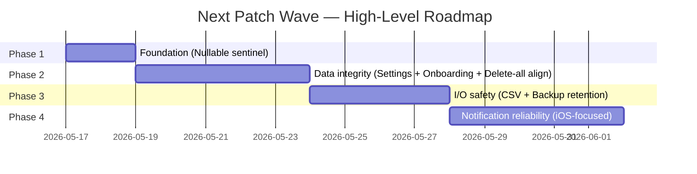

# [LP-SPEC] Next Patch Issues — Métra

```yaml
# metadata
project: metra
version: 1.0.0
supersedes: null
context-priority: high
```

**Date**: 2026-05-16
**Author**: lp-spec-writer
**Status**: draft
**Plan ref**: `.claude/docs/plans/lp-20260516-next-patch-issues-plan.md`

---

## 1. Context & Problem

### 1.1 Current state

Métra is a local-first, privacy-first menstrual cycle tracker built on Flutter 3.x + Riverpod 2.x + Drift/SQLCipher. The codebase is currently at version 0.x pre-MVP and the project board has accumulated a "Next Patch" column of 14 verified defects spread across five modules — Settings, CSV import/export, Backup/cloud sync, Onboarding, and Notifications. A `bug-hunter` assessment (`.claude/docs/specs/lp-20260516-next-patch-issues-assessment/`) has root-caused every issue, identified the affected files, surfaced cross-module dependencies, and proposed scope boundaries.

The defects fall into three behavioural classes:
- **Silent data loss**: an empty backup overwrites the user's only cloud snapshot after "Delete all data" (#11); a CSV round-trip silently drops rows with `pain_intensity = 0` (#20); switching to System theme overwrites notification time and first-day-of-week (#13).
- **Latent corruption**: `copyWith` cannot reset a nullable field to null (#16); the entity layer does not validate `notificationDaysBefore` (#22); the notification time picker silently rounds off-grid stored values (#21); `CompleteOnboarding` is non-transactional and produces duplicate anchor cycle entries after a crash mid-execution (#28); `OnboardingNotifier.setDate` accepts future dates (#29).
- **Unreliable I/O & UX**: CSV `deleteAndImport` mode erases all user data with no confirmation (#18); cloud backup retention is single-slot — one bad upload, no fallback (#12); iOS notification permission state is never correctly read or requested (#31); `PlatformException` from `zonedSchedule` is silently swallowed (#32); the cancel-then-reschedule path opens a window where no alarm is registered (#33); on iOS the alarm fires at the original UTC instant after a timezone change rather than the same wall-clock time (#35 iOS).

### 1.2 Problem statement

A pre-MVP patch wave is required to close fourteen verified defects that — taken together — break the project's core guarantees of local-first reliability, privacy-respecting silent backup, and accessibility-grade error prevention. Without this wave, the most consequential bugs (R-CRIT-1: silent backup destruction; R-CRIT-2: duplicate anchor corruption on new installs) ship into the MVP.

### 1.3 Opportunity

Closing all fourteen issues in a single coordinated wave preserves user trust at the most sensitive moment in the product lifecycle — the run-up to first public release — and prevents an irreversible class of failure (overwritten backups, corrupted prediction history) from reaching production. It also lets us promote one foundational tech-debt fix (the `Nullable<T>` sentinel in `copyWith`) that unblocks the cleanest possible patch for the Settings-module bugs and sets a project-wide standard for nullable preference fields. The patch wave lands before any new feature work consumes overlapping files (notably `settings_screen.dart` and `use_case_providers.dart`), avoiding rebase churn.

---

## 2. Goals & Non-Goals

### Goals

1. Eliminate every silent data-loss path identified in the assessment (#11 backup overwrite, #13 theme corruption, #20 CSV round-trip loss, #28 duplicate anchor corruption).
2. Add explicit confirmation to every irreversible destructive action exposed to the user (#18 CSV `deleteAndImport`).
3. Make backup retention resilient to a single corrupt upload by keeping at least one prior backup and one cross-month recovery point (#12).
4. Bring iOS notification handling to behavioural parity with Android: real permission state, real failure signal, timezone-resilient fire time (#31, #32 iOS, #35 iOS).
5. Lift validation from late-binding guards (use-case throws, UI clamps) up to the entity layer so non-UI callers cannot corrupt state silently (#22, #29).
6. Promote the foundational tech-debt fix needed to enable the cleanest possible patches downstream: `Nullable<T>` sentinel wrapper in `AppSettingsData.copyWith` (#16).
7. Add or strengthen the companion tests that would have caught each defect, including: delete-all → cold-start backup integration test, `pain_intensity = 0` round-trip test, double-`execute` onboarding test, iOS permission-denied widget test, and notification atomicity tests.

### Non-Goals

1. **Issue #35 Android timezone receiver**: native Kotlin `BroadcastReceiver` for `ACTION_TIMEZONE_CHANGED`, the MethodChannel handler, and the Dart-side reschedule entry point. This is excluded explicitly per the assessment — it crosses the native layer with no existing test pattern.
2. **`AppSettingsData` entity split** into `AppPreferencesData` + `AppSystemStateData`. Tracked as tech debt; deferred.
3. **`_handleImport` extraction** into a dedicated controller. The 110-line static method stays in-place; only the destructive-action confirmation dialog is added (#18).
4. **`notificationsServiceProvider` → `FutureProvider` migration**. Requires broader provider graph audit; deferred.
5. **Additional backup providers** (Google Drive, OneDrive). Only Dropbox is in scope. No new provider integrations.
6. **Visual redesign** of the settings screen or onboarding flow. Fixes preserve the existing layout, typography, and colour palette; only the #18 confirmation dialog is a new UI surface.
7. **Behavioural changes outside the 14 listed issues**, even where the assessment surfaces adjacent tech debt (`AppPreferencesData` split, shared pain-intensity constants beyond #20's scope, `notificationTimeMinutes` entity validation, `deleteAllForRestore()` semantic split, etc.). Those remain in the backlog.

---

## 3. Functional Requirements

| ID    | Requirement                                                                                                                                                                                                                                                                                                                                              | Priority |
| ----- | -------------------------------------------------------------------------------------------------------------------------------------------------------------------------------------------------------------------------------------------------------------------------------------------------------------------------------------------------------- | -------- |
| FR-01 | The system provides a `Nullable<T>` sentinel wrapper that lets `AppSettingsData.copyWith` distinguish "do not change this field" from "set this field to null", so any nullable field (including `darkMode`) can be reset to null via `copyWith`.                                                                                                        | Must     |
| FR-02 | Switching the theme to "System" preserves `notificationTimeMinutes`, `firstDayOfWeek`, `dropboxEmail`, and `lastBackupAt` exactly as they were before the switch — no field is reset to its default or to null.                                                                                                                                          | Must     |
| FR-03 | Re-opening the notification time picker and confirming without scrolling the wheel leaves `notificationTimeMinutes` unchanged in the database, even when the stored value is not aligned to a 5-minute grid.                                                                                                                                             | Must     |
| FR-04 | `AppSettingsData` rejects construction (and any `copyWith` call) with `notificationDaysBefore` outside the closed interval [1, `kMaxAdvanceDays`] at entity-construction time. The data layer surfaces DB rows containing out-of-range values loudly rather than masking them with a silent clamp.                                                       | Must     |
| FR-05 | `CompleteOnboarding.execute` is atomic from the user's standpoint: re-invoking it after a partial-failure crash never accumulates duplicate anchor `CycleEntries` for the same `startDate`.                                                                                                                                                              | Must     |
| FR-06 | `OnboardingNotifier.setDate` rejects any `DateTime` whose UTC calendar day is strictly after the current device UTC calendar day; the notifier does not depend on the date-picker UI for this guard.                                                                                                                                                     | Must     |
| FR-07 | After "Delete all data", the next silent cold-start backup does not upload an empty snapshot that would overwrite the user's most recent real backup; the skip guard signals "no new data since last backup" correctly.                                                                                                                                  | Must     |
| FR-08 | The CSV import flow displays an explicit secondary confirmation step before the `deleteAndImport` mode executes; the confirmation names the destructive consequence, shows the count of existing records that will be erased, and has a non-destructive default (Cancel). The `overwrite` and `keepExisting` modes are not gated by this confirmation.   | Must     |
| FR-09 | CSV encode and decode accept `pain_intensity = 0` as a valid value; round-tripping a row with `painEnabled = true, painIntensity = 0` preserves both fields exactly. Decode error messaging cites the correct valid range `0–3 or empty`.                                                                                                                | Must     |
| FR-10 | Cloud backup retention keeps at least the just-uploaded current backup, the most recent previous backup, and the most recent backup from the prior calendar month (when one exists), pruning only files outside this retention set. Best-effort delete failures do not block the upload.                                                                 | Must     |
| FR-11 | On iOS, the notification-permission methods (`requestPermission`, `hasNotificationPermission`) return the OS-reported state. Initialization does not auto-request notification permission; the OS dialog appears only on explicit user action (toggle on). When the OS denies permission, the in-app `notificationsEnabled` flag is reverted to `false`. | Must     |
| FR-12 | A `PlatformException` raised by `zonedSchedule` (e.g. `SCHEDULE_EXACT_ALARM` revoked on Android) is surfaced to the caller of `SchedulePredictionNotification` as an observable failure signal, and to the user as visible non-blocking feedback. The dead `PlatformException` catches in `app.dart` are removed or made substantive.                    | Must     |
| FR-13 | `SchedulePredictionNotification.execute` does not unconditionally cancel the existing alarm before rescheduling: on the normal scheduling path it relies on stable-ID replace semantics; it cancels explicitly only on the `prediction == null` and `notificationsEnabled == false` paths.                                                               | Must     |
| FR-14 | On iOS, scheduled prediction notifications fire at the configured wall-clock local time on the target date regardless of the device timezone at fire time (i.e. `wallClockTime` interpretation, not `absoluteTime`).                                                                                                                                     | Must     |
| FR-15 | Every functional change above is accompanied by at least one automated regression test that fails on the pre-fix code and passes on the post-fix code, in the test file identified by the assessment for that issue.                                                                                                                                     | Must     |

Priority key — **Must**: blocks the milestone that maps to this FR. **Should**: included if it does not jeopardise the milestone deadline. **Could**: deferred unless trivial to add.

---

## 4. Non-Functional Requirements

| ID | Category | Requirement | Metric |
|----|----------|-------------|--------|
| NFR-01 | Accessibility | Every destructive action exposed to the user provides an explicit, dismissible confirmation step compatible with WCAG 2.2 AA SC 3.3.4 (Error Prevention). Default focus is on the non-destructive option. | Visual review against WCAG SC 3.3.4 checklist; widget test asserts non-destructive default and dismissibility |
| NFR-02 | Reliability | After "Delete all data", no automatic backup is performed that would replace the user's most recent valid cloud snapshot with an empty one. | Integration test in `backup_notifier_test.dart` covering delete-all → cold-start `backupSilent()` → assert `backupSkipped` log and no upload |
| NFR-03 | Reliability | Cloud backup retention keeps ≥ 2 historical recovery points (current + previous) and ≥ 1 cross-month recovery point when ≥ 1 backup exists in the prior calendar month. | Unit test on `_retentionSet` (or equivalent) covering same-month-only, cross-month, January-boundary, and never-backed-up edge cases |
| NFR-04 | Privacy / Local-first | All fixes preserve the project's local-first and zero-knowledge cloud guarantees: no data leaves the device unencrypted, no telemetry, no analytics, no new third-party service contacts. | Code review: every new network/IO touch is encrypted-blob upload to Dropbox via the existing provider; no new package added to `pubspec.yaml` |
| NFR-05 | Data integrity | Entity-layer invariants (range, future-date guard) are enforced at construction time; data-layer read paths surface DB rows that violate invariants loudly (assert/throw in debug, log in release) instead of silently clamping. | Tests: out-of-range `notificationDaysBefore` triggers entity assert; corrupted DB row surfaces a logged warning on read |
| NFR-06 | Verifiability | iOS-specific fixes (#31, #32 iOS surface, #35 iOS) are verifiable on a physical iOS device via TestFlight, since no iOS simulator is available locally on Fedora Linux. | TestFlight smoke-test checklist filled before the Notifications phase is closed |
| NFR-07 | Maintainability | No new runtime dependency is added to `pubspec.yaml`. New abstractions (e.g. `Nullable<T>` sentinel, `TransactionRunner` interface if selected) live in the existing layered structure without crossing the `domain → data` import boundary. | `git diff pubspec.yaml` shows zero added runtime entries; `flutter analyze` reports no new layering violations |
| NFR-08 | Test coverage | Each affected use case and codec path is covered by a regression test that targets the specific defect; companion tests do not merely re-assert existing behaviour. | Per-FR test file mapping documented in the LP-plan; CI green on all new tests |

---

## 5. Architectural Constraints

### 5.1 Stack & patterns

- Flutter 3.x + Dart latest stable.
- Riverpod 2.x for state management, with `riverpod_generator` where it already helps; no introduction of an alternate state library.
- Drift ORM with SQLCipher for persistence; no new ORM, no raw SQLite usage.
- Strict layered architecture: `UI → Domain → Data`. `domain/` never imports from `data/` or `features/`. `features/` never imports directly from `data/database/` or `data/services/` — always through repositories.
- `Result<T, E>` or `sealed class` patterns for expected errors; `throw` only for programming errors.
- GPL-3.0 header on every new source file.
- `dart format` clean and `flutter analyze` clean as gate conditions for every commit.

### 5.2 Integration boundaries

| System | Direction | Contract / Notes |
|--------|-----------|------------------|
| Dropbox HTTP API | outbound | Used only via `DropboxProvider` (`lib/data/services/backup/dropbox_provider.dart`); contract for `listFiles()` (descending sort by filename) and `deleteFile()` is shared between Issues #11 and #12. `FakeDropboxProvider` in tests must replicate the descending-sort contract. |
| iOS Notification Center | outbound | Via `flutter_local_notifications` `IOSFlutterLocalNotificationsPlugin`. Permission state must be read from the OS, not assumed. Schedule interpretation: `UILocalNotificationDateInterpretation.wallClockTime`. |
| Android AlarmManager | outbound | Via `flutter_local_notifications` `AndroidFlutterLocalNotificationsPlugin`. `PlatformException` from `zonedSchedule` (e.g. `SCHEDULE_EXACT_ALARM` revoked) must be observable to the caller. Timezone-shift handling on Android is **out of scope** for this initiative. |
| SQLCipher-encrypted local DB | inbound + outbound | Source of truth. Migrations are forward-only and atomic. No raw SQL outside `data/database/`. |

### 5.3 Hard constraints

- **Local-first**: data is never sent to a server other than the user-configured cloud backup target (Dropbox in scope). No server-side component is introduced by any fix.
- **Zero-knowledge cloud**: anything uploaded is an AES-256-GCM encrypted blob; the encryption key never leaves the device. The backup retention fix (#12) operates on encrypted filenames only.
- **No telemetry**: no analytics, no third-party crash reporting, no tracking. Diagnostic logs stay local.
- **No new runtime dependencies**: `pubspec.yaml` is already curated; every fix must be expressible with the existing packages.
- **No iOS simulator locally**: iOS-touching fixes (#31, #32 iOS-surface, #35 iOS) are verified on a physical iOS device via TestFlight. Do not introduce code paths whose only verification mode is the iOS simulator.
- **Accessibility WCAG 2.2 AA minimum**: destructive-action confirmation (#18) and any new UI surface must meet WCAG 2.2 AA, including SC 3.3.4 (Error Prevention).
- **Domain stays pure**: domain classes do not import Drift, HTTP, or platform types. The transaction-runner abstraction for #28 (if selected) must respect this boundary.
- **Tests beside code**: a use-case or codec change without an accompanying regression test is not "done"; this gate applies to every FR in §3.

---

## 6. High-Level Roadmap



| Phase | Description | Key deliverable | FRs included | Depends on |
|-------|-------------|-----------------|--------------|------------|
| 1 — Foundation | Introduce the `Nullable<T>` sentinel wrapper and update `AppSettingsData.copyWith` to be sentinel-aware. This unblocks the clean fix for #13 and sets a project-wide pattern for nullable preference fields. | `Nullable<T>` in `lib/domain/entities/` (or `lib/core/`); updated `copyWith`; tests covering "set to null", "set to value", "leave unchanged" for `darkMode`. | FR-01 | — |
| 2 — Data integrity | Settings-module cleanup, onboarding safety, delete-all backup alignment. Fix the theme→System data loss using the sentinel from Phase 1, the time-picker rounding regression, the entity-level range guard, the onboarding transactional/idempotency fix, the future-date guard, and the delete-all → `lastLogOrSymptomWriteAt` realignment so the backup skip guard works after delete. | Updated `settings_screen.dart`, `app_settings_data.dart`, `complete_onboarding.dart`, `onboarding_notifier.dart`, `delete_all_data.dart` + provider wiring; companion tests including double-execute onboarding test and delete-all → cold-start backup integration test. | FR-02, FR-03, FR-04, FR-05, FR-06, FR-07 | Phase 1 |
| 3 — I/O safety | CSV import safety and backup retention policy. Add the destructive-action confirmation dialog before `deleteAndImport`. Fix the `pain_intensity = 0` decode off-by-one and add the round-trip test. Replace the single-slot prune loop in `SyncOrchestrator.backup()` with a 3-slot retention policy (current + previous + monthly). | Updated `csv_codec.dart`, `settings_screen.dart` (import dialog), `sync_orchestrator.dart`, new `_retentionSet` helper + dedicated unit-test file; new `.arb` strings for the confirmation copy (IT + EN). | FR-08, FR-09, FR-10 | Phase 2 |
| 4 — Notification reliability | iOS permission correctness, `PlatformException` surfacing, cancel-then-reschedule atomicity, iOS timezone-resilient interpretation. Update `FlutterNotificationService` to read OS-reported iOS permission state, remove the auto-request on init, surface `PlatformException` as an observable signal, remove the unconditional pre-cancel in `SchedulePredictionNotification`, and switch iOS to `wallClockTime`. Update the fake notification service and dead `app.dart` catches to match the new contract. | Updated `notification_service.dart`, `schedule_prediction_notification.dart`, `app.dart`; updated `FakeNotificationService` and test doubles; new iOS-permission-denied widget test; new atomicity tests. TestFlight smoke verified on physical iOS device. | FR-11, FR-12, FR-13, FR-14 | Phase 3 (provider-graph file `use_case_providers.dart` is touched in Phase 2; Phase 4 picks up post-merge to avoid wiring conflicts) |

FR-15 (regression-test gate) applies to every phase as a horizontal constraint and is verified at phase exit.

---

## 7. Risks & Mitigations

Mapping from assessment severity to template impact:
`R-CRIT-*` → Impact: **High**; `R-HIGH-*` → Impact: **High**; `R-MED-*` → Impact: **Medium**; `R-LOW-*` → Impact: **Low**. Likelihood is inferred from the assessment text and may need recalibration in the LP-plan.

| ID | Risk | Likelihood | Impact | Mitigation |
|----|------|-----------|--------|------------|
| R-01 | Silent backup destruction (#11): delete-all followed by cold-start uploads an empty encrypted blob to Dropbox, irreversibly overwriting the user's only real backup. No recovery path once overwritten. | High | High | Phase 2 fix in `DeleteAllData` aligns `lastLogOrSymptomWriteAt` to `lastBackupAt` after delete; integration test in `backup_notifier_test.dart` covering delete-all → `backupSilent()` → assert no upload. |
| R-02 | Duplicate anchor corruption (#28): crash between onboarding step 1 (`insert(anchor)`) and step 4 (`markOnboardingComplete`) on the no-log branch produces duplicate `CycleEntries` with the same `startDate`; cycle prediction becomes non-deterministic. Affects all new installs on low-memory Android. | High | High | Phase 2 fix introduces either (Option A) a `TransactionRunner` interface or (Option B) idempotent insert; double-execute regression test asserts `cycleRepo.entries.length == 1`. Final option choice is OQ-01. |
| R-03 | Theme→System data loss (#13): switching to System theme overwrites `notificationTimeMinutes` and `firstDayOfWeek` in the DB; user loses configured notification time silently. | High | High | Phase 1 ships `Nullable<T>`; Phase 2 replaces the bare `AppSettingsData(...)` constructor in `_showThemePicker` with `settings.copyWith(darkMode: const Nullable(null))`. |
| R-04 | Destructive CSV import (#18): `deleteAndImport` mode irrevocably erases all user data on a single tap with no confirmation. WCAG 2.2 AA SC 3.3.4 violation. | High | High | Phase 3 adds a secondary `AlertDialog` with explicit destructive copy, current record count, non-destructive default (Cancel), and destructive-styled confirm action. New `.arb` strings IT + EN. |
| R-05 | iOS notification permission desync (#31): `requestPermission` and `hasNotificationPermission` both return `true` unconditionally on iOS; toggle stays on after OS denial; auto-request on init fires the OS dialog at the wrong moment. | High | High | Phase 4 adds the iOS branch to both methods using `IOSFlutterLocalNotificationsPlugin`; removes the three `request*Permission: true` flags from `DarwinInitializationSettings`; widget test asserts toggle revert on denial. Requires TestFlight verification. |
| R-06 | Swallowed `PlatformException` (#32): `zonedSchedule` failures (e.g. Android `SCHEDULE_EXACT_ALARM` revoked) are silently swallowed; user loses scheduled notification with no feedback. Dead catches in `app.dart` (lines 167–169, 247–249) mask the gap. | High | High | Phase 4 surfaces failure as `Future<bool>` (OQ-02 confirms approach); dead catches removed or made substantive; SnackBar feedback added at settings listener; update `FakeNotificationService` to match new contract. |
| R-07 | `Nullable<T>` not promoted to a project-wide pattern (#16): every future nullable preference field repeats the bare-constructor workaround. | Medium | Medium | Phase 1 documents `Nullable<T>` as the project-standard pattern for nullable preference fields with a code comment on the sentinel class and a CHANGELOG/STATUS note. |
| R-08 | CSV `pain_intensity = 0` round-trip loss (#20): row is silently dropped on import; due to `continue`, the row's symptoms and notes are also lost. | Medium | Medium | Phase 3 changes `pv < 1` → `pv < 0` and updates error string to `'Expected 0–3 or empty'`; new round-trip test in `csv_codec_test.dart`. |
| R-09 | Single-slot backup retention (#12): one corrupt upload leaves the user with no fallback. | Medium | Medium | Phase 3 implements 3-slot retention (current + previous + monthly); dedicated unit-test file for `_retentionSet`; existing orchestrator test rewritten to assert new semantics. |
| R-10 | Notification atomicity gap (#33): unconditional pre-cancel creates a window where no alarm is registered; if combined with #32, a scheduling failure after cancel permanently loses the alarm. | Medium | Medium | Phase 4 removes the unconditional pre-cancel; explicit cancel only on null-prediction and disabled-notifications paths; new test asserting `cancelCount == 0` on the normal scheduling path. Depends on #32 fix for the "cancel + fail" regression test. |
| R-11 | Delete-all edge: `lastBackupAt == null` (#11 edge case): user with passphrase but never-backed-up triggers delete-all → cold-start uploads empty as if first-ever backup. | Medium | Medium | Phase 2 fix handles the `lastBackupAt == null` branch explicitly: when no prior backup exists, do not align to a future-significant value — the skip guard's "no prior backup" branch is correct only when the DB is non-empty. |
| R-12 | `FakeDropboxProvider` sort-order divergence (#12): if the fake returns files in insertion order rather than descending-sorted order, retention computes wrong `previous` and `monthly` slots. | Medium | Medium | Phase 3 audits `FakeDropboxProvider.listFiles()` and adds a contract test asserting descending sort, before the retention test is written. |
| R-13 | Time-picker silent rounding (#21): off-grid stored `notificationTimeMinutes` (from future migrations or CSV imports) silently rounded to nearest 5 minutes on picker re-open. Low frequency today; grows as data paths multiply. | Low | Low | Phase 2 separates the display seed (`_roundTo5`) from the save baseline (original value); `onRestore` writes the original value, not the rounded one. |
| R-14 | Missing entity-level range guard (#22): `notificationDaysBefore = 0` crashes `SchedulePredictionNotification` at runtime with no traceable origin. Today only reachable via non-UI callers. | Low | Low | Phase 2 adds `assert` in the constructor; data-layer surfaces DB corruption as a logged warning rather than silently clamping. |
| R-15 | Future-date anchor (#29): `OnboardingNotifier.setDate` accepts future dates; UI picker constrains but notifier is unguarded. Mostly a maintenance risk. | Low | Low | Phase 2 guards `setDate` against future UTC calendar days; two new tests (tomorrow rejected; UTC+N midnight edge case accepted). |
| R-16 | iOS `wallClockTime` semantics shift (#35 iOS): switching from `absoluteTime` to `wallClockTime` changes fire interpretation for all already-scheduled alarms. For users in flight at the moment of upgrade, transition behaviour depends on iOS scheduling internals. | Low | Low | Phase 4 verifies via TestFlight on a physical iOS device; commit message notes the semantic shift; existing `computeScheduledTz` tests continue to pass. |
| R-17 | Android timezone-change resilience deferred (#35 Android): out of scope; users who change timezone on Android continue to receive alarms at the original UTC instant. | Low | Low | Documented as a Non-Goal (§2); tracked as a separate backlog item for a follow-up initiative. Acceptable given assessment-confirmed low frequency for typical users. |
| R-18 | Shared file contention: `settings_screen.dart` is touched by FRs FR-02, FR-03, FR-04, FR-08 across phases 2 and 3. Concurrent edits risk merge conflicts. | Low | Medium | Sequence Phase 2 settings work and Phase 3 CSV dialog work in the same branch or serialise commits; document the touch points in the LP-plan. |
| R-19 | `use_case_providers.dart` is the wiring file for both `DeleteAllData` (#11) and `CompleteOnboarding` (#28). | Low | Medium | Land both provider-graph changes in the same Phase 2 commit to avoid double-touch; cover the wiring with provider tests. |

---

## 8. Open Questions

- [x] **OQ-01** — ✅ **Decided 2026-05-16**: Option A — `TransactionRunner` abstract interface in `lib/domain/repositories/` + `DriftTransactionRunner` implementation in `lib/data/repositories/` delegating to `AppDatabase.transaction`. Injected as a 5th constructor argument into `CompleteOnboarding`. Steps 1–4 of `execute` wrapped in a single transaction.
- [x] **OQ-02** — ✅ **Decided 2026-05-16**: Option A — `SchedulePredictionNotification.execute` returns `Future<bool>` (true = scheduled, false = failed). All callers propagate the signal; settings listener shows a non-blocking SnackBar on false. `FakeNotificationService` and `use_case_providers.dart` updated to match the new return type.
- [ ] **OQ-03** — [ASSUMED] Likelihood values for risks R-01 … R-19 are inferred from the assessment text (frequency cues such as "all new installs", "primary scenario", "low frequency today"). Recalibrate at LP-plan time against deployment data if available.
- [ ] **OQ-04** — [ASSUMED] Phase durations in the Gantt are rough estimates (Phase 1: 2d, Phase 2: 5d, Phase 3: 4d, Phase 4: 5d). The LP-plan will refine these from task-level decomposition.

---

## 9. Glossary

| Term | Definition |
|------|------------|
| Anchor cycle entry | The `CycleEntry` row inserted by `CompleteOnboarding.execute` representing the user's declared last period start, with a null `cycleLength`. Used as the prediction reference point when no flow logs exist. |
| `AppSettingsData` | The domain entity (`lib/domain/entities/app_settings_data.dart`) holding both user preferences and system-managed settings. |
| `backupSilent()` | The cold-start silent backup entry point in `BackupNotifier` (`lib/features/backup/state/backup_notifier.dart`), gated by a skip guard that compares `lastLogOrSymptomWriteAt` against `lastBackupAt`. |
| `BackupFilename.parseTimestamp` | Utility in `lib/data/services/backup/backup_filename.dart` that extracts a UTC `DateTime` from a backup filename of the form `metra_backup_<timestamp>.enc`, returning `null` for non-conforming names. |
| `CompleteOnboarding` | The domain use case (`lib/domain/use_cases/complete_onboarding.dart`) that finalises the onboarding flow: inserts the anchor, optionally recomputes cycle entries, persists settings, marks onboarding complete. |
| `CSV deleteAndImport` mode | Import mode that calls `_logRepo.deleteAllAndReplace(...)` — erases all existing daily logs and writes the imported set. The destructive mode targeted by #18. |
| `DarwinInitializationSettings` | Configuration object passed to `flutter_local_notifications.initialize()` controlling iOS/macOS init-time behaviour, including the `request*Permission` flags removed by the #31 fix. |
| `_handleImport` | The static method in `settings_screen.dart` (lines 788–899) that orchestrates CSV import (file pick, decode, mode dialog, execute, snackbar). |
| `kPredictionNotificationId` | Stable notification ID (1001) used by the prediction-notification scheduling path. Stable ID is the basis for `flutter_local_notifications` replace semantics relied on by the #33 fix. |
| `lastBackupAt` | Timestamp of the last successful Dropbox backup, stored in settings. Read by the backup skip guard. |
| `lastLogOrSymptomWriteAt` | Timestamp of the last write to a daily log or symptom, stored in settings. The skip guard compares it against `lastBackupAt` to decide whether silent cold-start backup is needed. |
| MASVS L1+L2 | OWASP Mobile Application Security Verification Standard, Levels 1 and 2 (80% coverage target adopted by the Métra plan). |
| `metra_backup_*.enc` | Naming convention for encrypted backup blobs in the user's Dropbox folder. |
| `Nullable<T>` | Project-standard sentinel wrapper introduced by FR-01 that distinguishes "do not change this field" from "set this field to null" in `copyWith` signatures. |
| `_retentionSet` | Pure static helper (introduced by FR-10) computing the set of backup filenames to retain — current + previous + monthly. |
| `SCHEDULE_EXACT_ALARM` | Android 12+ runtime permission required for `flutter_local_notifications` to schedule exact alarms; revocation triggers the `PlatformException` covered by FR-12. |
| Skip guard | The check in `BackupNotifier.backupSilent()` that decides whether to upload by comparing `lastLogOrSymptomWriteAt` and `lastBackupAt`. |
| `SyncOrchestrator` | The data-layer service (`lib/data/services/backup/sync_orchestrator.dart`) that drives backup upload, prune, and restore against a `BackupProvider` (currently `DropboxProvider`). |
| `TransactionRunner` | Proposed domain interface (`abstract class TransactionRunner`) for OQ-01 Option A; implementation `DriftTransactionRunner` lives in the data layer and delegates to `AppDatabase.transaction`. |
| `UILocalNotificationDateInterpretation.wallClockTime` | iOS scheduling interpretation that fires the alarm at the same wall-clock local time on the target date regardless of timezone at fire time; replaces `absoluteTime` in FR-14. |
| WCAG 2.2 AA SC 3.3.4 | "Error Prevention (Legal, Financial, Data)" success criterion — destructive actions require confirmation, reversal, or check. The criterion violated by #18 and remediated by FR-08. |

---

## 10. Spec Impact (conditional)

N/A — this is a new LP-spec, not a revision. Per the template guidance, this section is filled only at LP-spec revision time when user-visible behavior, public contracts, declared limits, or enumerated providers/dependencies change.
