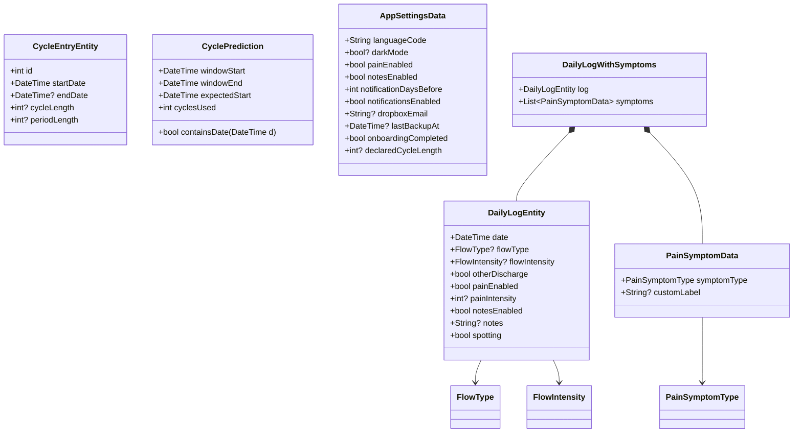
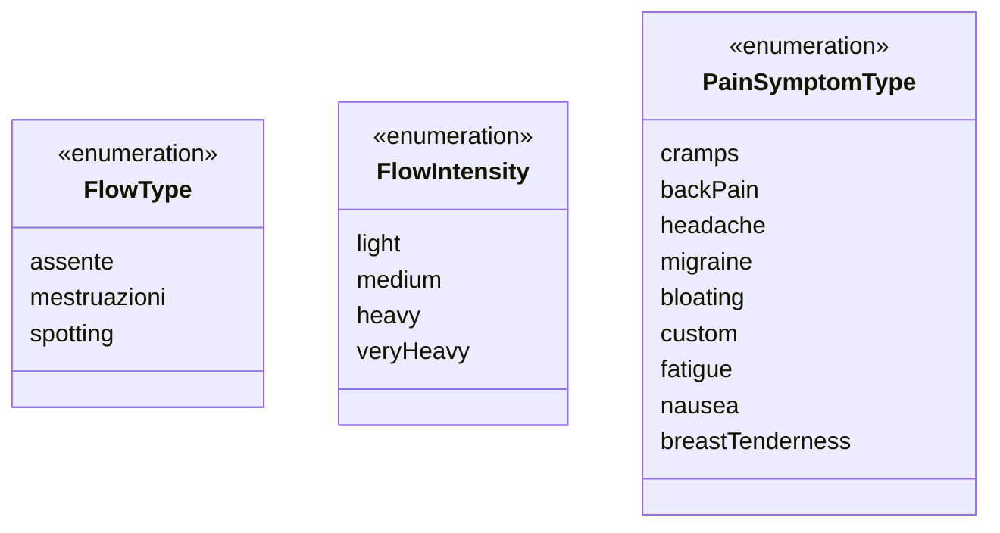

# Contribute to Mētra: system architecture

<!-- author notes: voice calibrated from project copy and CLAUDE.md. Formality 3/5, second person, contractions on, dry warmth. Class diagram split into two blocks (entities/enums, then repositories/services) for GitHub Mermaid readability — combined diagram exceeded ~30 nodes and was unreadable. Several field names, enum values, and method signatures in the task brief were stale; all reconciled against actual source code. See the author notes section at the bottom for a full list of corrections. -->

---

## Table of contents

1. [Principles](#1-principles)
2. [Directory layout](#2-directory-layout)
3. [Layering rules](#3-layering-rules)
4. [Domain model](#4-domain-model)
   - 4.1 [Entities and value objects](#41-entities-and-value-objects)
   - 4.2 [Enums](#42-enums)
   - 4.3 [Repository interfaces](#43-repository-interfaces)
   - 4.4 [Services — domain layer](#44-services--domain-layer)
5. [Data layer](#5-data-layer)
   - 5.1 [Database schema](#51-database-schema)
   - 5.2 [Services — data layer](#52-services--data-layer)
   - 5.3 [Startup sequence](#53-startup-sequence)
6. [State management](#6-state-management)
7. [Navigation](#7-navigation)
8. [Backup and encryption](#8-backup-and-encryption)
9. [Key architectural decisions](#9-key-architectural-decisions)
10. [Testing](#10-testing)
11. [CI/CD](#11-cicd)

---

## 1. Principles

Five constraints are non-negotiable. Every architectural choice is evaluated against them.

| # | Principle | What it rules out |
|---|---|---|
| 1 | **Local-first** — data lives on the device; no proprietary server | Analytics pipes, cloud-as-source-of-truth patterns |
| 2 | **Zero-knowledge cloud** — the provider sees only encrypted blobs; the key never leaves the device | Server-side password reset, unencrypted uploads |
| 3 | **No telemetry** — zero analytics, zero third-party crash reporting | Firebase, Sentry, or any SDK that phones home |
| 4 | **Accessibility built-in** — WCAG 2.2 AA minimum, AAA where possible | Shipping a screen without `Semantics` + 44 dp tap targets |
| 5 | **Respect the adult user** — no dark patterns, no gamification | Motivational push notifications, streak counters, social features |

---

## 2. Directory layout

```
metra/
├── lib/
│   ├── main.dart               # Entry point: initialise SQLCipher, open DB, run app
│   ├── app.dart                # MaterialApp, theme, global Riverpod listeners
│   ├── core/                   # Shared infrastructure (all three layers may import this)
│   │   ├── constants/
│   │   ├── errors/             # MetraException hierarchy
│   │   ├── theme/              # metra_colors.dart, metra_typography.dart, metra_spacing.dart
│   │   ├── utils/
│   │   └── widgets/            # MetraIcon, MetraTabBar, MetraWordmark, ChoiceChipMetra
│   ├── domain/                 # Pure Dart — no Flutter, no Drift
│   │   ├── entities/           # Immutable value objects
│   │   ├── repositories/       # Abstract interfaces only
│   │   ├── services/           # CyclePredictionService, CsvCodec, NotificationService (interface)
│   │   └── use_cases/
│   ├── data/                   # Data layer
│   │   ├── database/           # Drift schema (AppDatabase, v5) + DAOs + migrations
│   │   ├── repositories/       # Drift implementations of domain interfaces
│   │   └── services/
│   │       ├── backup/         # BackupService, SyncOrchestrator, DropboxProvider
│   │       ├── encryption_service.dart
│   │       ├── key_management_service.dart
│   │       └── notification_service.dart  # FlutterNotificationService
│   ├── features/               # Screens + Riverpod notifiers
│   │   ├── backup/
│   │   ├── calendar/
│   │   ├── daily_entry/
│   │   ├── onboarding/
│   │   ├── settings/
│   │   ├── stats/
│   │   └── timeline/
│   ├── providers/              # Riverpod provider factories (repository_providers.dart, etc.)
│   └── router/                 # app_router.dart — go_router config + ShellRoute
├── test/
│   ├── domain/
│   ├── data/
│   ├── features/
│   ├── core/
│   ├── helpers/                # Fakes, mocks, shared test utilities
│   └── goldens_*/              # Golden image snapshots
├── design/                     # DESIGN-BIBLE.md + Figma-source HTML mockups
├── wiki/                       # This documentation
├── android/
├── ios/
├── assets/
└── fonts/
```

---

## 3. Layering rules

Dependencies flow in one direction only: `UI → Domain → Data`. `core/` sits outside the dependency chain — all three layers may import it.

```
┌─────────────────────────────────────────────────┐
│  features/   (UI, Riverpod notifiers, widgets)  │
└────────────────────┬────────────────────────────┘
                     │  imports via providers/
┌────────────────────▼────────────────────────────┐
│  domain/  (entities, repository interfaces,     │
│            services, use cases)                 │
└────────────────────┬────────────────────────────┘
                     │  implements interfaces
┌────────────────────▼────────────────────────────┐
│  data/    (Drift impls, EncryptionService,      │
│            KeyManagementService, backup/)        │
└─────────────────────────────────────────────────┘

     ◀────────────────────────────────▶
                  core/
```

Violations that are never permitted:

- `domain/` importing from `data/` or `features/`
- `features/` importing directly from `data/database/` or `data/services/` — always through `domain/repositories/`
- Domain errors exposing Drift or HTTP types

---

## 4. Domain model

### 4.1 Entities and value objects



Key invariants enforced in the domain:

- `flowIntensity` must be `null` unless `flowType == FlowType.mestruazioni` (the DM-02 invariant, checked in `SaveDailyLog`).
- `cycleLength` is `null` on the most-recent cycle entry — it is defined as the gap to the next cycle, which doesn't exist yet. `CyclePredictionService` anchors on the most-recent cycle's `startDate` independently of the WMA window, which uses only complete cycles.
- `AppSettingsData.declaredCycleLength` is deliberately excluded from `copyWith` — it is write-only via `AppSettingsRepository.saveDeclaredCycleLength()` and is never reset by general settings updates.
- `CyclePrediction.cyclesUsed == 0` signals an estimated (Strategy B) rather than a measured prediction.

### 4.2 Enums



`FlowType` maps to an integer column (`flow_type INT`) in the database. The mapping is `assente=0, mestruazioni=1, spotting=2`. `FlowIntensity` similarly maps `light=0, medium=1, heavy=2, veryHeavy=3`. `veryHeavy` is retained only for backward compatibility with schema v3 rows; new entries should use at most `heavy`.

### 4.3 Repository interfaces

```mermaid
classDiagram
    class DailyLogRepository {
        <<interface>>
        +watchDay(DateTime date) Stream~DailyLogEntity?~
        +watchMonth(int year, int month) Stream~List~DailyLogEntity~~
        +getAllOrderedByDate() Future~List~DailyLogEntity~~
        +saveDailyLog(DailyLogEntity log) Future~void~
        +deleteDailyLog(DateTime date) Future~void~
        +getPainSymptoms(DateTime date) Future~List~PainSymptomData~~
        +getSymptomDatesForMonth(int year, int month) Future~Set~DateTime~~
        +watchSymptomDatesForMonth(int year, int month) Stream~Set~DateTime~~
        +replacePainSymptoms(DateTime date, List~PainSymptomData~ symptoms) Future~void~
        +deleteAll() Future~void~
        +deleteAllAndReplace(List~DailyLogEntity~ logs, Map symptoms) Future~void~
        +upsertAllLogs(List~DailyLogWithSymptoms~ entries) Future~void~
    }

    class CycleEntryRepository {
        <<interface>>
        +watchAll() Stream~List~CycleEntryEntity~~
        +getRecent(int n) Future~List~CycleEntryEntity~~
        +insert(CycleEntryEntity entry) Future~CycleEntryEntity~
        +update(CycleEntryEntity entry) Future~void~
        +delete(int id) Future~void~
        +replaceAll(List~CycleEntryEntity~ entries) Future~void~
        +deleteAll() Future~void~
    }

    class AppSettingsRepository {
        <<interface>>
        +watchSettings() Stream~AppSettingsData?~
        +getOrCreate() Future~AppSettingsData~
        +updateSettings(AppSettingsData settings) Future~void~
        +markOnboardingComplete() Future~void~
        +updateBackupState(String? dropboxEmail, DateTime? lastBackupAt) Future~void~
        +saveDeclaredCycleLength(int cycleLength) Future~void~
    }

    class SyncLogRepository {
        <<interface>>
        +append(SyncLogEntity log) Future~void~
        +getRecent(int limit) Future~List~SyncLogEntity~~
        +deleteAll() Future~void~
    }

    class DriftDailyLogRepository {
        <<Drift implementation>>
    }
    class DriftCycleEntryRepository {
        <<Drift implementation>>
    }
    class DriftAppSettingsRepository {
        <<Drift implementation>>
    }
    class DriftSyncLogRepository {
        <<Drift implementation>>
    }

    DriftDailyLogRepository ..|> DailyLogRepository
    DriftCycleEntryRepository ..|> CycleEntryRepository
    DriftAppSettingsRepository ..|> AppSettingsRepository
    DriftSyncLogRepository ..|> SyncLogRepository
```



Implementations live in `lib/data/repositories/`. They are wired to Riverpod providers in `lib/providers/repository_providers.dart` — features never instantiate them directly.

### 4.4 Services — domain layer

```mermaid
classDiagram
    class CyclePredictionService {
        +predict(List~CycleEntryEntity~ cycles, int? declaredCycleLength) CyclePrediction?
    }

    class CsvCodec {
        +encode(List~DailyLogEntity~ logs) String
        +decode(String csv) List~DailyLogEntity~
    }

    class NotificationService {
        <<interface>>
        +initialize() Future~void~
        +schedulePredictionNotification(DateTime notifyAt, String title, String body) Future~void~
        +cancelPredictionNotifications() Future~void~
        +requestPermission() Future~bool~
    }

    class FlutterNotificationService {
        <<data layer implementation>>
    }

    FlutterNotificationService ..|> NotificationService

    class EncryptionService {
        +encrypt(Uint8List plaintext, String passphrase) Future~Uint8List~
        +decrypt(Uint8List blob, String passphrase) Future~Uint8List~
    }

    class KeyManagementService {
        +getOrCreateDatabaseKey() Future~String~
        +deleteDatabaseKey() Future~void~
    }

    class BackupService {
        +buildSnapshot() Future~BackupSnapshot~
    }

    class CloudBackupProvider {
        <<interface>>
        +upload(Uint8List blob, String filename) Future~void~
        +download(String filename) Future~Uint8List~
        +listFiles() Future~List~String~~
        +deleteFile(String filename) Future~void~
    }

    class DropboxProvider {
        <<data layer implementation>>
    }

    class BackupRunner {
        <<interface>>
        +backup() Future~void~
        +restore() Future~void~
    }

    class SyncOrchestrator {
        <<data layer implementation>>
    }

    DropboxProvider ..|> CloudBackupProvider
    SyncOrchestrator ..|> BackupRunner
    SyncOrchestrator --> BackupService
    SyncOrchestrator --> EncryptionService
    SyncOrchestrator --> CloudBackupProvider
```



**`CyclePredictionService`** (pure, const)

Predicts the next cycle start using a Weighted Moving Average over the three to six most recent complete cycles. `cycleLength == null` entries are excluded from the WMA window. When fewer than three complete cycles exist, falls back to the user-declared `declaredCycleLength` (Strategy B), advancing by whole-cycle increments until the prediction is in the future. Returns `null` when both measured data and declared length are insufficient.

```
WMA weight: oldest = 1, most recent = n
anchor = most-recent cycle overall (may be incomplete)
window = ±2 days around expected start
```

**`CsvCodec`** (domain layer)

Encodes and decodes `DailyLogEntity` lists to/from CSV format. Used by `ExportDailyLogs` and `ImportDailyLogs` use cases.

**`NotificationService`** (interface — domain layer)

Abstract contract with no Flutter or platform imports. Methods: `initialize()`, `schedulePredictionNotification(DateTime, String, String)`, `cancelPredictionNotifications()`, `requestPermission()`. The concrete implementation is `FlutterNotificationService` in `data/services/`.

`requestPermission()` returns `false` on Android 13+ if the user denies the OS dialog. The settings notifier reverts `notificationsEnabled` to `false` immediately in that case — the toggle never stays on after a denial.

---

## 5. Data layer

### 5.1 Database schema

The database is a SQLCipher-encrypted SQLite file. Schema is at version 5.

| Table | Purpose |
|---|---|
| `daily_logs` | One row per calendar day (primary key: UTC-midnight `DateTime`) |
| `pain_symptoms` | Many-to-one with `daily_logs`; one row per symptom per day; cascade-deletes with the parent |
| `cycle_entries` | Derived from `daily_logs`; recomputed on every mutation by `RecomputeCycleEntries` |
| `symptom_templates` | User-defined custom symptom types (label + active flag) |
| `app_settings` | Singleton settings row (always `id = 1`) |
| `sync_logs` | Local audit trail of backup/restore operations; never included in the backup blob |

Migration history:

| Version | Change |
|---|---|
| v1 → v2 | Added `dropboxEmail`, `lastBackupAt` to `app_settings` |
| v2 → v3 | Added `onboardingCompleted` to `app_settings` |
| v3 → v4 | Added `flow_type` column to `daily_logs`; migrated legacy `spotting` bool and `FlowIntensity` index shifts |
| v4 → v5 | Added `declaredCycleLength` to `app_settings` (Strategy B) |

`AppDatabase.initializeSQLCipher()` must be called once at startup on Android to override the system sqlite3 with the SQLCipher build. The override is isolate-local, so it is repeated inside the `NativeDatabase.createInBackground` `isolateSetup` callback.

### 5.2 Services — data layer

**`KeyManagementService`**

Generates a 256-bit random key as a 64-character hex string and persists it in `flutter_secure_storage` under the key `metra_db_encryption_key_v1`. `getOrCreateDatabaseKey()` is idempotent — it returns the existing key if valid, generates a new one otherwise. `deleteDatabaseKey()` is called only during a full data wipe; calling it renders the database permanently irrecoverable.

**`EncryptionService`**

Used exclusively for cloud backup blobs — not for database-level encryption. Blob format: `[16-byte salt][12-byte nonce][ciphertext][16-byte GCM MAC]`. Key derivation uses Argon2id (64 MB memory, 3 iterations, parallelism 4, 32-byte output). Each `encrypt()` call generates a fresh random salt and nonce, so two encryptions of the same plaintext produce different blobs.

**`BackupService`**

Builds a `BackupSnapshot` from the current `DailyLogRepository` contents. The snapshot is serialized to JSON, then passed to `EncryptionService.encrypt()` by `SyncOrchestrator`.

**`SyncOrchestrator`** (implements `BackupRunner`)

Coordinates backup and restore. On backup: build snapshot → encrypt with user passphrase → upload → verify → prune older files → update settings and sync log. On restore: download latest file → decrypt → replace all logs → recompute cycle entries → update sync log. Both paths record a `SyncLogEntity` regardless of success or failure. The passphrase is stored in `flutter_secure_storage` under `metra_backup_passphrase_v1`; it is never persisted in the database.

**`DropboxProvider`** (implements `CloudBackupProvider`)

OAuth2 PKCE flow via `flutter_web_auth_2`. On Android the callback URL (`metra://oauth-callback`) is handled by `MainActivity` (registered as `singleTop`) rather than a separate `CallbackActivity`, which prevents Chrome Custom Tab from sticking in the foreground after the redirect.

**`FlutterNotificationService`** (implements `NotificationService`)

Uses `flutter_local_notifications` and `flutter_timezone`. Schedules at 09:00 local time using a stable notification ID so re-scheduling replaces rather than duplicates. Wraps `zonedSchedule()` in a `try/catch(PlatformException)` because Android can revoke the `SCHEDULE_EXACT_ALARM` permission at any time.

### 5.3 Startup sequence

```
main()
 ├─ AppDatabase.initializeSQLCipher()          # Android: override sqlite3 with SQLCipher build
 ├─ KeyManagementService.getOrCreateDatabaseKey()  # flutter_secure_storage
 ├─ AppDatabase.openConnection(path, hexKey)   # LazyDatabase → NativeDatabase (background isolate)
 │   └─ setup: PRAGMA key, PRAGMA cipher_version (fail-loud), PRAGMA foreign_keys = ON
 ├─ FlutterNotificationService.initialize()
 └─ runApp(ProviderScope(child: MetraApp()))
```

---

## 6. State management

The app uses Riverpod 2.x throughout.

| Pattern | When to use |
|---|---|
| `AsyncNotifier` | Mutable state with loading/error (settings, daily entry, backup) |
| `StreamProvider.autoDispose` | Drift streams exposed to the UI (watch queries) |
| `FutureProvider` | Read-once async initialization (repository instances) |
| `Provider` | Synchronous derived state or service instances |

Key providers in `lib/providers/`:

- `dailyLogRepositoryProvider` — `FutureProvider<DailyLogRepository>`
- `cycleEntryRepositoryProvider` — `FutureProvider<CycleEntryRepository>`
- `appSettingsRepositoryProvider` — `FutureProvider<AppSettingsRepository>`
- `appSettingsStreamProvider` — `StreamProvider<AppSettingsData?>` — reactive read of the singleton settings row
- `syncLogRepositoryProvider` — `FutureProvider<SyncLogRepository>`
- `painSymptomsProvider` — `FutureProvider.autoDispose.family<List<PainSymptomData>, DateTime>`

The prediction pipeline uses `StreamProvider<CyclePrediction?>` (`async* { yield* uc(); }`) rather than an `AsyncNotifier` + `Completer`. This eliminates a race condition where the Completer could complete synchronously while a later stream emission arrived on the next microtask, overwriting the state with stale data.

`app.dart` holds a `ref.listen` on both `appSettingsStreamProvider` and the prediction stream. The settings listener handles the notification permission flow: it calls `requestPermission()` on the false→true toggle transition and reverts `notificationsEnabled` if the user denies.

---

## 7. Navigation

Routes are declared in `lib/router/app_router.dart` using go_router.

| Path | Screen | Tab bar |
|---|---|---|
| `/onboarding` | `OnboardingScreen` | Hidden |
| `/calendar` | `CalendarScreen` | Tab 0 — Calendario |
| `/timeline` | `TimelineScreen` | Tab 1 — Archivio |
| `/stats` | `StatsScreen` | Tab 2 — Statistiche |
| `/settings` | `SettingsScreen` | Tab 3 — Impostazioni |
| `/daily-entry/:date` | `HistoricalEntryScreen` | Hidden |
| `/backup` | `BackupScreen` | Hidden |

The four tab routes share a `ShellRoute` wrapping `_ScaffoldWithNav`. That widget renders `MetraTabBar` — a custom frosted-glass bar (84 dp, `BackdropFilter blur(16)`, custom SVG icons via `MetraIcons`). Full-screen routes (`/onboarding`, `/daily-entry/:date`, `/backup`) are declared outside the `ShellRoute` so the tab bar does not render.

**Redirect guard:** the `GoRouter.redirect` callback checks `AppSettingsData.onboardingCompleted`. If `false`, every route except `/onboarding` redirects to `/onboarding`. The check is async (reads from the repository) and is skipped when `state.uri.path == '/onboarding'` to avoid a redirect loop.

**Date parameter:** `/daily-entry/:date` expects an ISO 8601 date string (`YYYY-MM-DD`). The router parses it as UTC midnight to match `DailyLogEntity.date` storage format.

---

## 8. Backup and encryption

Two independent encryption layers protect user data.

**Layer 1 — at-rest database encryption (SQLCipher)**

The Drift database file is encrypted with a 256-bit key managed by `KeyManagementService` via the OS keychain (`flutter_secure_storage`). The key is never stored in the database or in plaintext on disk. Without the key the file is unreadable binary. The key is not included in backups and has no server-side recovery path.

**Layer 2 — cloud backup encryption (AES-256-GCM)**

When the user backs up to Dropbox, the serialized snapshot is additionally encrypted with a user-supplied passphrase before upload. The passphrase is derived to a 256-bit key using Argon2id. The cloud provider stores only the encrypted blob (`metra_backup_*.enc`). The provider has no access to the plaintext or the passphrase.

On restore after a fresh install, `BackupScreen` prompts for the passphrase before calling `SyncOrchestrator.restore()`. The passphrase dialog uses `unlock` mode (no minimum length) rather than the `setNew` mode (8-character minimum) used during initial backup setup, because the AES-GCM authentication tag will fail downstream if the passphrase is wrong.

---

## 9. Key architectural decisions

| Decision | Choice | Rationale |
|---|---|---|
| Local-first persistence | Drift + SQLCipher | No cloud dependency for core functionality; AES-256 encryption at the file level |
| State management | Riverpod 2.x | Testable, auto-dispose, code-gen compatible; `AsyncNotifier` separates loading/error cleanly |
| Routing | go_router | Declarative; `redirect` supports the onboarding guard without imperative navigation |
| Prediction algorithm | WMA over 3–6 complete cycles | Balances accuracy against cold-start; degrades gracefully to `declaredCycleLength` when fewer than 3 gaps exist |
| Strategy B fallback | `declaredCycleLength` in `AppSettings` | Allows useful predictions from day one without requiring historical data |
| `cycleLength` on most-recent cycle | Always `null` | Defined as gap to the next cycle; decoupling anchor from WMA window prevents predictions landing in the past |
| Schema migrations | Drift `MigrationStrategy` | Type-safe migrations; v4 rearchitected `FlowType` from a boolean `spotting` field to a three-value enum |
| `periodLength` counting | Flow day count, not span | Two logged flow days with a 19-day intra-episode gap (below `_kNewCycleGapDays = 21`) would otherwise report `periodLength = 20` |
| Prediction as `StreamProvider` | Replaces `AsyncNotifier` + `Completer` | Eliminates the race where `completer.complete(A)` flips `.isCompleted` synchronously but resolves on the next microtask, allowing a later `B` emission to overwrite with stale `A` |
| Android OAuth callback | `MainActivity` (singleTop), not `CallbackActivity` | Chrome Custom Tab stays in a separate task; routing the intent-filter through the existing `singleTop` MainActivity task lets `onNewIntent` handle the redirect and Chrome backgrounds correctly |
| iOS builds | GitHub Actions macOS runner | No local Mac available; free tier for public repos; physical device testing via TestFlight |

---

## 10. Testing

The test suite lives in `test/` and mirrors the source structure.

```
test/
├── domain/
│   └── services/          # CyclePredictionService: 0/1/2/3/6/10 cycles, edge cases
├── data/
│   ├── database/          # Drift DAO tests, migration tests
│   ├── repositories/      # Drift repository implementations
│   └── services/          # EncryptionService round-trips, KeyManagementService
├── features/
│   ├── backup/            # BackupNotifier, BackupScreen (widget tests)
│   ├── calendar/          # CalendarMonthNotifier, CalendarScreen (widget tests)
│   ├── daily_entry/       # Daily entry flow, custom symptom tests
│   └── settings/          # SettingsScreen state-binding tests
├── core/
│   └── widgets/           # Widget tests + golden snapshots
├── helpers/               # FakeDailyLogRepository, FakeCycleEntryRepository, etc.
└── goldens_*/             # Platform-specific golden images
```

Minimum coverage targets:

- All `data/services/` classes: unit tests.
- `CyclePredictionService`: cases with 0, 1, 2, 3, 6, and 10 cycles; edge cases for very short/long cycles and missing gaps.
- `EncryptionService`: encrypt → decrypt round-trip; different IVs produce different ciphertext; wrong passphrase throws `CryptoException`.
- Domain use cases: 80% line coverage minimum.
- Main screens (calendar, daily entry, stats, settings, backup): widget tests.

Run the suite:

```bash
flutter test
```

Run with coverage:

```bash
flutter test --coverage
genhtml coverage/lcov.info -o coverage/html
```

---

## 11. CI/CD

Three GitHub Actions workflows run on every push to `main` and on pull requests.

| Workflow | Trigger | Jobs |
|---|---|---|
| `android.yml` | push, PR | `flutter analyze` + `flutter test` + build APK |
| `ios.yml` | tag `v*` | `flutter analyze` + `flutter test` + build IPA + upload TestFlight |
| `quality.yml` | push, PR | `dart format --set-exit-if-changed` + `flutter analyze` + coverage |

**Versioning:** SemVer. `pubspec.yaml` is the source of truth. MVP = `0.1.0`, first public release = `1.0.0`.

Commit messages follow Conventional Commits (`feat:`, `fix:`, `refactor:`, `docs:`, `test:`, `chore:`). The git log is public documentation.

**Privacy Policy** is published at `https://<user>.github.io/metra/privacy` (GitHub Pages / `docs/`). The URL appears in the Settings screen.

---

<!-- author notes

Voice calibration: formality 3/5. Codebase is Italian-branded but code and docs are in English. Technical contributors audience — denser than consumer prose, tighter sentences, tables over paragraphs where possible. Contractions on. No exclamation points. Dry warmth in transitions.

Class diagram split rationale: the brief asked for a single combined Mermaid classDiagram. At ~35 nodes with relationships, GitHub's Mermaid renderer produces an unreadable hairball. Split into three blocks: (1) entities + enums; (2) repository interfaces + Drift implementations; (3) services (domain + data). This satisfies the stated quality bar ("Keep the class diagram readable").

Corrections made against source code (task brief was stale):

- PainSymptomType enum values: actual are `cramps, backPain, headache, migraine, bloating, custom, fatigue, nausea, breastTenderness`. Brief used Italian names (`crampi`), missed `migraine` and `custom`, and wrote `breastTension` (actual: `breastTenderness`).
- PainSymptomData field: `symptomType`, not `type`.
- CycleEntryRepository interface: actual methods are `watchAll, getRecent(int n), insert, update, delete, replaceAll, deleteAll`. Brief truncated to `watchAll, getAll, replaceAll, deleteAll`.
- AppSettingsRepository interface: actual methods are `watchSettings, getOrCreate, updateSettings, markOnboardingComplete, updateBackupState, saveDeclaredCycleLength`. Brief listed `getOrCreate, save, saveDeclaredCycleLength, watch`.
- SyncLogRepository interface: actual methods are `append, getRecent({int limit}), deleteAll`. Brief listed `insert, getAll`.
- KeyManagementService method: `getOrCreateDatabaseKey()`, not `getOrCreateKey()` as the brief wrote.
- Schema version: database is at v5 (verified in `AppDatabase.schemaVersion`). The directory comment in the brief said "v4" — corrected to v5 throughout.
- BackupService: actual `buildSnapshot()` method only (no serialize/deserialize — those are handled by `BackupSnapshot.encode()`/`decode()` and `EncryptionService`). Updated the description accordingly.
- SyncOrchestrator: implements `BackupRunner` (a domain use-case interface), not a standalone class as the brief implied.
- DropboxProvider: extends the `CloudBackupProvider` abstract class in `data/services/backup/dropbox_provider.dart`.
- AppSettingsRepository method name: `watchSettings()`, not `watch()`.

No [VERIFY:] claims remain — all descriptions are traceable to source files read in this session.

-->
